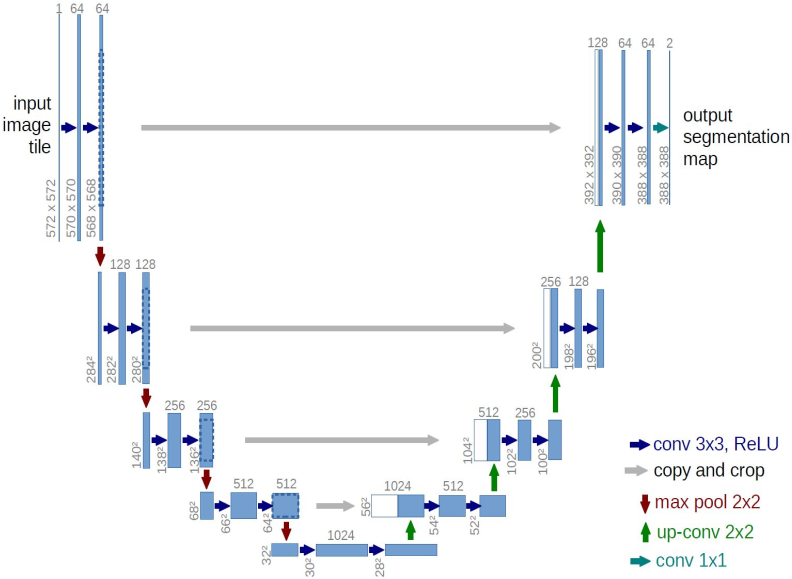
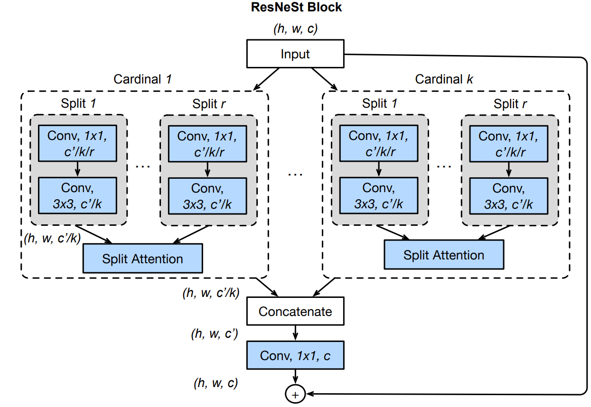

# Segmenting Car Parts with Deloitte

## Final Project of Deep Learning at DTU.
This repo holds the notebooks and source files to recreate our results, and possibly also train the three different networks. The dataset used is **NOT** provided, as it is confidential. 
Instead, we provide 10 manually annotated images in the `data` directory, to replicate that of the given dataset. Despite there being a `test.npy` and `train.npy` in that directory, these are the same exact arrays and can be viewed as "placeholders". Training on `train.npy` will not yield comparable results.
When evaluating the models with `evaluation.ipynb`, the performance is measured on these 10 test images (as opposed to the 30 provided images in the report). 

### Structure
The structure of the repo is as follows:
```
.
├── data
│   ├── holds all data (10 manually generated images)
├── hpc
│   ├── holds the same structure as used during training with HPC
├── notebooks
│   ├── holds all the Jupyter notebooks (as remote)
└── src
    ├── holds all python source files (as remote)
```


***
### Testing
To reproduce our results, first make sure that all libraries listed in `requirements.txt` are installed. Then, simply clone the repo and download the trained models by running the file `download_extract_models.py` from the root directory:
```bash
python3 src/download_extract_models.py
```
**Note:** the trained models require **965MB** of free disk space. 

This will first download the trained models, before extracting them, creating the folder `trained_models` holding all of them. It's important this step is performed before trying to run the evaluation notebook. 

Finally, run the notebook called `evaluation.ipynb`, where you'll be able to evaluate each model's performance in the final cell, as well as viewing its prediction on one of the images from the test set. 
***
### Technical details
For this project, three models have been implemented and trained on the provided dataset: **U-Net**, U-Net with **ResNeSt** as encoder, and **U$^2$-Net**.

#### U-Net


Our implementation of the U-Net model follows the original, as described in [this paper](https://arxiv.org/abs/1505.04597). It consists of a symmetric encoder-decoder structure, giving the U shape as seen above. The network utilises *skip connections* in order to be able to both extract features progressively moving down the downsampling path, as well as preserving as much spatial information as possible.

#### ResNeSt


Our second model replaces the encoder, or the downsampling path, in the original U-Net to rather use a *Split-attention network* (ResNeSt). This architecture stacks several blocks as seen above ResNet style, to ultimately give what is known as ResNeSt. The implementation is inspired by the [original paper](https://arxiv.org/abs/2004.08955), with the addition of skip connections needed for the U-Net decoder. 

#### U$^2$-Net 


The final model is also implemented like [the original](https://arxiv.org/abs/2005.09007), with only minor changes. It consists of two nested U-structures, with the aim of extracting even finer details and relationships in the data - ideal for segmentation tasks. 
***
### Results


| **Model**   | **mIoU**  | **Pixel accuracy** | **Runtime** |
| ----------- | --------- | ------------------ | ----------- |
| U-Net       | 51.1%     | 88.3%              | 264ms       |
| ResNeSt-50  | 50.6%     | 88.5%              | **68ms**    |
| ResNeSt-100 | 54.6%     | 90.0%              | **83ms**    |
| ResNeSt-200 | 56.1%     | 90.2%              | **124ms**   |
| U$^2$-Net   | **59.5%** | **90.6%**          | 402ms       |

Above, each model's performance on one of the images from the original test data can be seen. The model using ResNeSt is trained with three different depths, i.e. number of layers: 50, 101 and 200 respectively. 

The combined performance on all of the 30 test images can be seen in the table, which displays the mean intersection over union (mIoU, i.e. how much of the predicted mask overlaps the ground truth mask for each class), the pixel accuracy and the runtime of the models. 